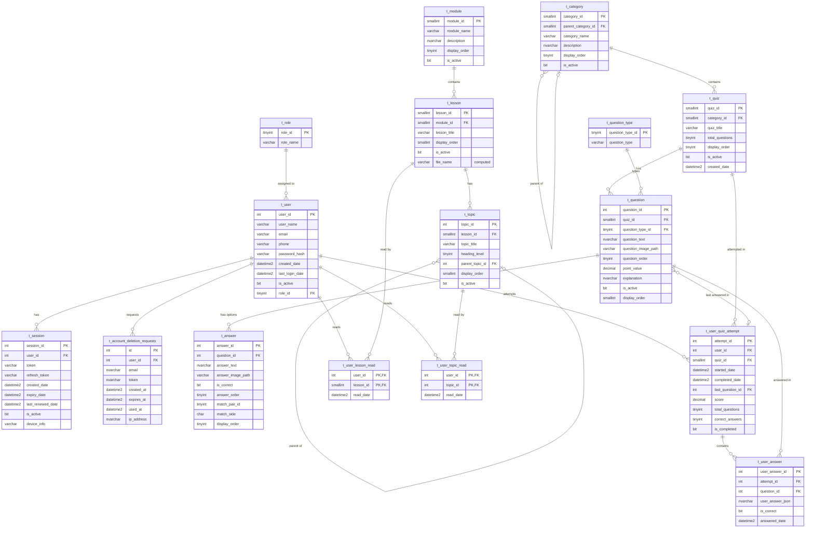

# VexTrainer Database Schema

Entity-relationship diagram for the VexTrainer01 database.
For setup instructions see [README.md](README.md).

---

## ER Diagram

---

## Key Design Notes

**Computed column — `t_lesson.file_name`**
Automatically generates the Markdown filename from `module_id` and `lesson_id`.
Format: `{module_id_5digits}-{lesson_id_5digits}.md`
Example: module 4, lesson 12 → `00004-00012.md`
Matches filenames in the [vextrainer-content](https://github.com/VexTrainer/vextrainer-content) repository.

**Self-referencing tables**
Both `t_category` and `t_topic` support hierarchical nesting via
`parent_category_id` and `parent_topic_id` respectively.
Top-level records have `NULL` in the parent column.

**Composite primary keys**
`t_user_lesson_read` and `t_user_topic_read` use composite PKs on
`(user_id, lesson_id)` and `(user_id, topic_id)` — enforcing one
progress record per user per lesson/topic at the database level.

**Matching questions**
`t_answer.match_pair_id` and `t_answer.match_side` support matching
question types. Answers sharing the same `match_pair_id` form a pair,
with `match_side = 'L'` for left column and `'R'` for right column.

**JSON answers**
`t_user_answer.user_answer_json` stores student answers in a flexible
JSON format to accommodate all question types without separate tables:
- Multiple choice: `{"selected_answer_id": 42}`
- Matching: `{"pairs": [{"left": 1, "right": 3}]}`
- Fill in blank: `{"answer_text": "PROS"}`

**Access control**
No direct table permissions are granted to any user or role.
All data access is exclusively through stored procedures,
with `EXECUTE` permission granted to the `staff` role only.
See [README.md](README.md) for the full security model.
